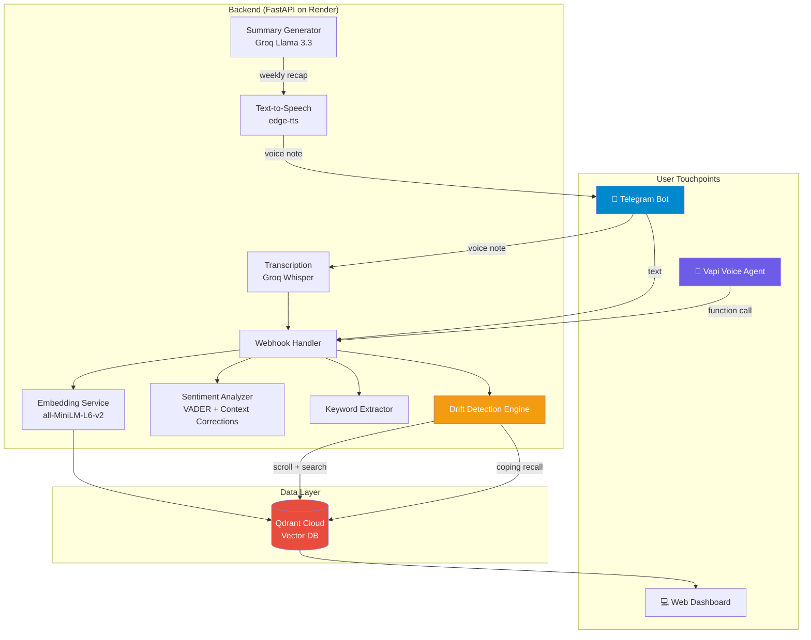
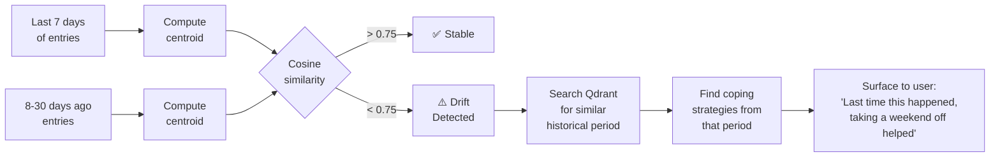
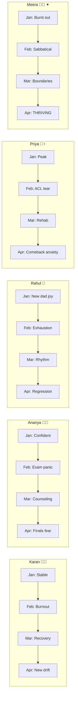
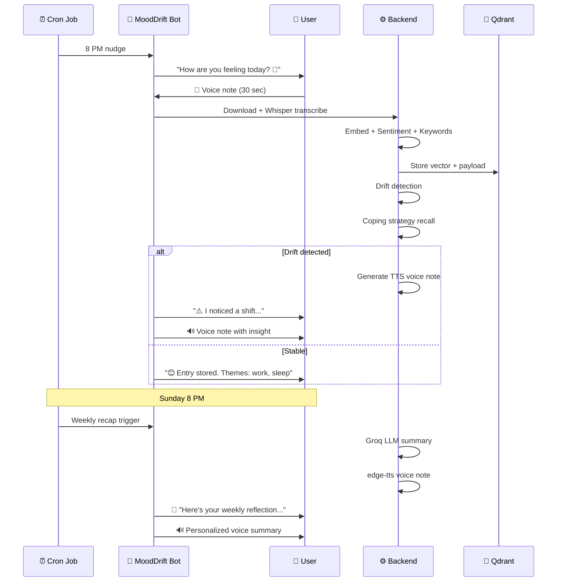

# How We Built a Journal That Talks Back — MoodDrift at BL-Hack 2026

*A voice-first emotional awareness tool that listens to your words, remembers what helped, and notices the patterns you can't see yourself.*

---

## It Started with Rohan

Rohan is one of my closest friends. Software engineer, sharp mind, always the one cracking jokes in the group chat. The kind of guy you'd never think was struggling.

Last October, he told us he'd been seeing a psychiatrist for three months. None of us knew. He said the hardest part wasn't the sessions themselves — it was everything *between* them. Two weeks between appointments. By the time he sat down with his doctor, he'd forgotten half of what happened. The bad days blurred together. The good days felt like they didn't count.

His psychiatrist suggested journaling. "Write down how you feel every day. It'll help you spot patterns."

Rohan downloaded Daylio. Rated his mood with emojis for four days. Then forgot. Downloaded Reflectly. Typed two entries. Stopped. He tried three more apps. Same story every time.

*"I'd open it, see the blank page, and just… close it. I didn't have the energy to type out my feelings. And even when I did, I'd never go back and read them. What's the point of a journal nobody reads?"*

That conversation stuck with me. Because Rohan isn't lazy. He's exhausted. And the tools designed to help him were failing because they demanded effort from someone who had none to give.

Then the hackathon theme dropped: **Voice AI for Accessibility & Societal Impact.**

And I thought: *what if Rohan's journal could just listen?*

---

## 85% Drop Out. We Wanted to Know Why.

Rohan wasn't alone. The data confirmed what he told us over chai:

- **85% of people quit journaling apps within 2 weeks.** The friction of typing kills it.
- **450 million people** worldwide have mental health conditions (WHO). Journaling is clinically proven to help — but only if you actually do it.
- **Nobody reads their own patterns.** You don't notice you're drifting into burnout until you're already burned out. The journal has the data — but no one's analyzing it.
- **Accessibility is an afterthought.** People with low literacy, motor disabilities, cognitive overload, or those who simply think better out loud? Excluded entirely.

We kept coming back to what Rohan said: *"I didn't have the energy to type."*

So we asked a different question: **What if you didn't have to?**

What if you could just *talk* — for two minutes, into your phone, while walking home — and your journal not only recorded it, but understood it, remembered it, and one day said:

> *"Hey, your entries this week sound a lot like mid-October, when you described feeling burnt out. Last time, you said taking a weekend completely offline helped. Would that work for you right now?"*

That's MoodDrift.

We built it for Rohan. And for everyone like him.

When you say "I can barely sleep, deadlines are crushing me, and I snapped at my colleague today" — that sentence contains a rich semantic fingerprint. It's not a 3/5. It's not a 😐. It's a vector in 384-dimensional space that can be compared, clustered, and tracked over time.

## How It Actually Works (The Part Rohan Would Ask About)

When Rohan sends a voice note to @MoodDriftBot on Telegram saying *"I can barely sleep, deadlines are crushing me"* — here's what happens under the hood in about 5 seconds:

1. **Groq Whisper** transcribes the audio
2. **sentence-transformers** converts his words into a 384-dimensional vector — a semantic fingerprint of how he feels
3. **VADER + our context corrections** score the sentiment (and yes, "can't sleep" is correctly negative — we'll get to that story later)
4. The vector + metadata lands in **Qdrant** with a timestamp
5. The **drift engine** compares this week's centroid against his baseline
6. If drift is detected, it searches for **what helped last time** and surfaces it

Rohan gets back: *"I noticed a shift in your recent entries. This feels similar to mid-October. Last time, taking a weekend offline helped — would that work for you right now?"*

He didn't type a word. He didn't open a dashboard. He talked into his phone for 30 seconds while making chai.

---

## The Architecture (aka "How does talking into Telegram become insight?")



The secret sauce isn't any single component — it's how they compose. Qdrant isn't just storing vectors; it's being used as a **temporal vector analysis engine**. We're not doing RAG. We're doing something the Qdrant team probably didn't expect: comparing vector distributions over time to detect emotional shift.

---

## The Drift Detection Algorithm

This is the heart of MoodDrift. Here's how it works:



The algorithm computes the **centroid** (mean vector) of your recent entries and compares it to your baseline. If the cosine similarity drops below 0.75, drift is detected. Then it searches for which historical period matches your current state — and retrieves what *you said helped* last time.

This isn't generic advice. It's *your own words*, from *your own recovery*, served back to you at exactly the moment you need them.

---

## The Five Personas: Making Data Feel Human

A demo with one user profile is a tech demo. Five personas with complete emotional arcs? That's a product.

We created five realistic journaling profiles, each with 45-62 entries spanning 3 months:



Meera is the star. She's the teacher who burns out in January, takes a sabbatical, travels to Rishikesh, rediscovers yoga and painting, returns with boundaries, and ends up **thriving**. She exists to prove that MoodDrift doesn't just detect problems — it celebrates recovery.

---

## The Telegram Bot: Where Users Actually Live

We built a beautiful web dashboard. Then we realized nobody would open it.

> The insight has to go TO the user. Not sit on a webpage waiting.

Enter **@MoodDriftBot** on Telegram. Here's the daily flow:



Why Telegram and not WhatsApp? Free API, no Meta approval, voice notes both ways, no 24-hour template window. 50M+ users in India. The decision took 30 seconds.

---

## The Sentiment Problem (and How We Fixed It)

We started with VADER from NLTK. It's the standard. It's fast. It's free.

It's also **terribly wrong** for mental health language.

| Entry | VADER Score | Reality |
|---|---|---|
| "Two nights of no sleep. I'm snapping at everyone." | **+0.08** 😐 | Obviously negative |
| "Deadlines everywhere, skipping meals, barely sleeping" | **+0.18** 🙂 | Very negative |
| "Mind won't stop racing about deadlines" | **+0.22** 🙂 | Negative |

VADER is lexicon-based. It scores individual words. "Sleep" isn't negative. "Everyone" isn't negative. "No sleep" together is devastating — but VADER doesn't understand two-word context.

**Our fix:** Keep VADER as the base (it handles 70% of cases well), then add 20+ regex-based corrections for patterns VADER systematically misses:

```python
_NEGATIVE_PATTERNS = [
    r"\bno sleep\b", r"\bcan'?t sleep\b", r"\bbarely slept?\b",
    r"\bsnapp(?:ing|ed)\b", r"\bskipp(?:ing|ed) meals?\b",
    r"\bpanic attack\b", r"\bcried\b", r"\bbroke(?:n)? down\b",
    r"\ball over again\b",  # "this feels like X all over again"
    ...
]
```

**After the fix:**

| Entry | Before | After | Correct? |
|---|---|---|---|
| "No sleep, snapping at everyone" | +0.08 | **-0.67** | ✅ |
| "Skipping meals, barely sleeping" | +0.18 | **-0.07** | ✅ |
| "Gym felt amazing, sleeping well" | +0.82 | **+0.86** | ✅ |

VADER + domain-specific context corrections. Still VADER at the core — just smarter about mental health language.

---

## The Feature That Could Save Someone

We almost didn't build this one. Trusted Contact Alerts.

The idea: if your emotional drift score stays dangerously high for several days, and you've opted in, MoodDrift sends a gentle message to someone you trust.

Not your therapist. Not a helpline. Your mom. Your best friend. Your partner.

> "Hi — Karan has given you permission to receive this message. Their recent journal entries suggest they may be going through a difficult time. You might want to check in with them. No entry content is shared — only that a pattern was noticed. — MoodDrift"

The privacy rules are strict:
- **Opt-in only.** You set `/trust @username` in Telegram.
- **Revocable anytime.** `/untrust` removes it instantly.
- **No content shared.** Ever. Only the fact that drift was detected.
- **Trusted contact can't access anything.** No dashboard, no entries, nothing.

This feature exists because sometimes the person spiraling is the last one to notice.

---

## What We Actually Built: The Numbers

| Metric | Count |
|---|---|
| Backend endpoints | 15 |
| Test cases | **157** (all passing) |
| Seeded journal entries | 261 across 5 profiles |
| User personas | 5 (4 drift arcs + 1 positive) |
| Telegram bot commands | 6 (/start, /status, /recap, /trust, /untrust, voice/text) |
| Cron jobs | 5 |
| Services integrated | Qdrant, Vapi, Groq (LLM + Whisper), edge-tts, Telegram, Render |
| Lines of Python | ~2,500 |
| Lines of TypeScript | ~1,200 |
| Dashboard tabs | 4 (Today, Journal, Insights, Settings) |

---

## The Tech Stack (and Why)

| Choice | Why |
|---|---|
| **Qdrant** (mandatory) | Not just vector search — temporal vector distribution analysis. Scroll API with payload filtering = time-series for emotions. |
| **Vapi** (mandatory) | Multi-turn voice conversations with function calling. The agent calls Qdrant mid-conversation to reference past entries by date. |
| **Groq** (Llama 3.3 70B) | Free, fast, generates warm natural-language summaries. Not clinical. Not robotic. |
| **sentence-transformers** (MiniLM) | Local, free, 384-dim. No API call needed for embeddings. Runs on Render free tier. |
| **edge-tts** | Free Microsoft Neural voices. Indian English. Converts weekly recaps to voice notes. |
| **Telegram Bot API** | Free, instant, voice notes both ways, no approval needed. The user is already there. |
| **React + Vite** | Fast, warm UI. Tab navigation. Print-to-PDF therapist reports. |

---

## The Differentiator (Memorize This)

If anyone asks "How is this different from Daylio?"

> "Daylio can tell you 'you rated Tuesday a 3/5.' MoodDrift can tell you 'your entries this week sound like mid-February, when you were burning out from deadline pressure — and back then, you said taking a weekend offline helped. Would that work for you right now?'"
>
> **They track. We understand.**

---

## What's Next

MoodDrift today is an MVP. Here's what makes it a product:

1. **WhatsApp integration** — when Meta Business API approval comes through, the 500M daily users in India get access.
2. **Persistent user storage** — replace in-memory registry with a real database.
3. **Therapist portal** — therapists receive reports directly, not via PDF.
4. **Multi-language embeddings** — full Hindi, Tamil, Bengali support with multilingual sentence transformers.
5. **Wearable correlation** — sleep data from smartwatches correlated with journal sentiment (but carefully — we're a mirror, not a doctor).

---

## Back to Rohan

I showed him MoodDrift last night.

He sent a voice note while sitting on his couch: *"Work was okay today, but I've been feeling this low-level dread all week. Like something's off but I can't name it."*

Five seconds later, the bot replied with his themes, his sentiment, and noted that his entries this week felt different from his baseline.

He stared at his phone. Then he said something I didn't expect:

*"This is the first time an app noticed something about me that I didn't notice myself."*

He sent three more voice notes that night.

His psychiatrist appointment is next Tuesday. For the first time, he's going to walk in with a [therapist report](https://github.com/karan68/mooddrift) — sentiment trends, key entries, coping strategies — generated from his own words. No more forgetting. No more blurred-together weeks.

That's why we built MoodDrift. Not for a hackathon. For Rohan. For the 450 million people like him who deserve a journal that doesn't give up on them when they can't give to it.

*MoodDrift doesn't diagnose. It mirrors. It's your journal that listens, remembers, and notices what you don't.*

---

**GitHub:** [github.com/karan68/mooddrift](https://github.com/karan68/mooddrift)  
**Live API:** [mooddrift-api.onrender.com](https://mooddrift-api.onrender.com)  
**Telegram:** [@MoodDriftBot](https://t.me/MoodDriftBot)
