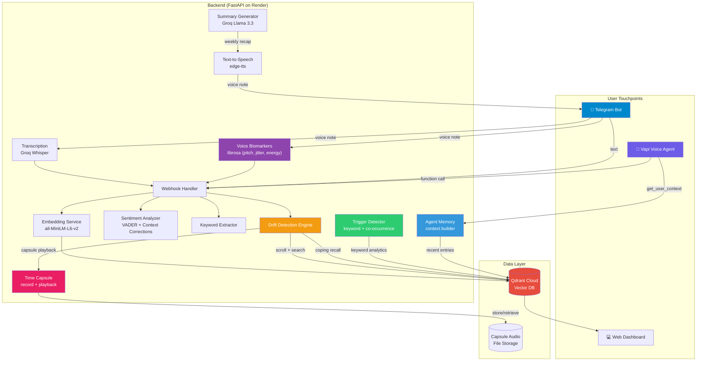
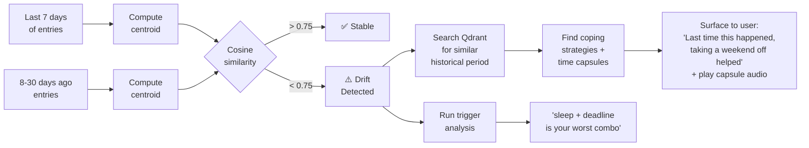
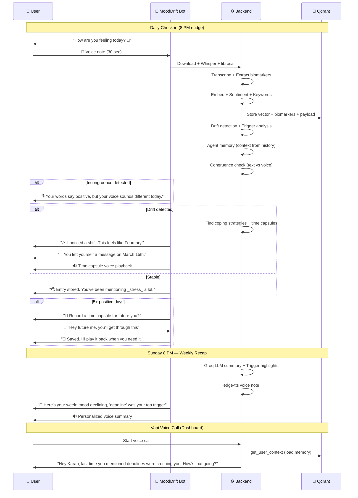
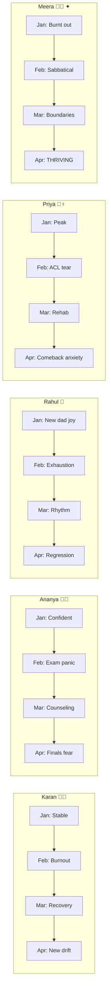

# How We Built a Journal That Talks Back — MoodDrift at BL-Hack 2026

*A voice-first emotional awareness tool that listens to your words, analyzes your voice, remembers what helped, and notices the patterns you can't see yourself.*

---

## It Started with Rohan

Rohan is one of my closest friends. Software engineer, sharp mind, always the one cracking jokes in the group chat. The kind of guy you'd never think was struggling.

Last October, he told us he'd been seeing a psychiatrist for three months. None of us knew. He said the hardest part wasn't the sessions themselves — it was everything *between* them. Two weeks between appointments. By the time he sat down with his doctor, he'd forgotten half of what happened. The bad days blurred together. The good days felt like they didn't count.

His psychiatrist suggested journaling. "Write down how you feel every day. It'll help you spot patterns."

Rohan downloaded Daylio. Rated his mood with emojis for four days. Then forgot. Downloaded Reflectly. Typed two entries. Stopped. He tried three more apps. Same story every time.

*"I'd open it, see the blank page, and just… close it. I didn't have the energy to type out my feelings. And even when I did, I'd never go back and read them. What's the point of a journal nobody reads?"*

That conversation stuck with me. Because Rohan isn't lazy. He's exhausted. And the tools designed to help him were failing because they demanded effort from someone who had none to give.

Then the hackathon theme dropped: **Voice AI for Accessibility & Societal Impact.**

And I thought: *what if Rohan's journal could just listen?*

What if it could hear the exhaustion in his voice — even when his words say "I'm fine"?

---

## 85% Drop Out. We Wanted to Know Why.

Rohan wasn't alone. The data confirmed what he told us over chai:

- **85% of people quit journaling apps within 2 weeks.** The friction of typing kills it.
- **450 million people** worldwide have mental health conditions (WHO). Journaling is clinically proven to help — but only if you actually do it.
- **Nobody reads their own patterns.** You don't notice you're drifting into burnout until you're already burned out. The journal has the data — but no one's analyzing it.
- **Accessibility is an afterthought.** People with low literacy, motor disabilities, cognitive overload, or those who simply think better out loud? Excluded entirely.

So we asked: **What if you didn't have to type?**

What if you could just *talk* — for two minutes, into your phone, while walking home — and your journal not only recorded it, but analyzed your voice for stress, remembered what helped you before, identified your triggers, and one day said:

> *"Hey, your entries this week sound a lot like mid-October, and your voice has been lower energy than your baseline. Last time, you said taking a weekend offline helped. Also — every time you mention sleep and deadlines together, your mood drops significantly. Would taking that weekend off work for you right now?"*

That's MoodDrift. We built it for Rohan. And for everyone like him.

---

## How It Actually Works

When Rohan sends a voice note to @MoodDriftBot on Telegram saying *"I can barely sleep, deadlines are crushing me"* — here's what happens under the hood in about 5 seconds:

1. **Groq Whisper** transcribes the audio
2. **librosa** extracts vocal biomarkers — pitch variance, speech rate, pause ratio, energy, jitter — to detect how he *sounds*, not just what he *says*
3. **sentence-transformers** converts his words into a 384-dimensional vector — a semantic fingerprint of how he feels
4. **VADER + our 20 mental-health corrections** score the sentiment (and yes, "can't sleep" is correctly negative)
5. **Incongruence detection** compares text sentiment against vocal stress — if his words say "fine" but his voice says otherwise, we flag it
6. The vector + biomarkers + metadata land in **Qdrant** with a timestamp
7. The **drift engine** compares this week's centroid against his baseline
8. The **trigger detector** identifies that "sleep + deadlines" is his worst keyword combination
9. If drift is detected, it searches for **what helped last time** and checks for **time capsule** recordings from positive periods
10. The **agent memory** builds context so the next conversation starts with "Hey, last time you mentioned deadlines were getting to you..."

Rohan gets back: *"I noticed a shift in your entries. This feels similar to mid-October. Your voice sounds lower energy than usual. Last time, taking a weekend offline helped — and your entries mentioning 'deadline' are consistently your most negative. Would that work for you right now?"*

He didn't type a word. He talked into his phone for 30 seconds while making chai.

---

## The Architecture



The secret sauce isn't any single component — it's how they compose. Qdrant isn't just storing vectors; it's being used as a **temporal vector analysis engine**, a **keyword analytics platform**, and a **real-time context store** for agent memory. We're not doing RAG. We're doing something the Qdrant team probably didn't expect: comparing vector distributions over time to detect emotional shift, correlating keyword co-occurrences with sentiment to find triggers, and building personal vocal baselines to catch incongruence.

---

## The Five X-Factor Features

### 1. Voice Biomarkers & Incongruence Detection

When someone says "I'm fine" in a flat, slow monotone — they are not fine. Every mental health professional knows this. Every journaling app ignores it.

We analyze **six acoustic properties** of every voice note using librosa:

| Biomarker | What It Reveals |
|---|---|
| **Pitch variance** (F0 std) | Low = flat affect = depression signal |
| **Speech rate** (syl/sec) | Fast = anxiety, slow = fatigue |
| **Pause ratio** | More pauses = cognitive load |
| **Energy (RMS)** | Low = withdrawal, high = agitation |
| **Jitter** | Voice tremor = stress |
| **Vocal stress score** | Weighted composite of all above |

The X-factor: **Incongruence Detection.** When text sentiment is positive but vocal biomarkers indicate distress → we flag the mismatch:

> "Your words sound positive, but your voice has a different tone than usual today. Sometimes we say we're fine before we realise we're not — how are you really feeling?"

No journaling app does this. We compare against the user's **personal vocal baseline** computed from their history in Qdrant. This is clinically grounded — vocal biomarkers for depression detection are published in Nature Digital Medicine (2023).

### 2. Voice Time Capsule

The most powerful coping strategy isn't advice from an app. It's **hearing your own voice from when you were okay.**

During good periods (5+ positive entries in a row), MoodDrift prompts:
> "You've been doing really well. Want to record a message to your future self?"

The capsule is stored with an optional **open date**. When drift is detected weeks later, it's played back:
> "Things feel different this week. But you left yourself a message on March 15th. Here it is:"
> 🔊 *[User's own voice]: "Hey future me — if you're hearing this, things got hard again. But remember, you got through February. Go for a walk. Call Mom. You'll be okay."*

Coping recall tells you **what helped** (text). Time capsule lets you **hear yourself** (voice). The emotional impact is incomparable.

### 3. Trigger Pattern Detection

Drift detection tells you **that** you shifted. Trigger detection tells you **why**.

We correlate keywords, time-of-day, and **keyword co-occurrences** with sentiment across all entries:

> "Entries mentioning **deadline** have an average sentiment of -0.68 (3× · ◐ medium confidence)"
> "When **sleep** and **deadline** appear in the same entry, your mood drops to -0.70 (toxic combination)"
> "Entries mentioning **friends** lift your mood to +0.76 (power combination)"

This transforms passive journaling into **actionable intelligence**. Daylio shows "you rated Monday 2/5." We show "sleep + deadline is your worst combination, and here's the data."

### 4. Agent Memory

Every Vapi call and every Telegram conversation used to start from zero. Now the agent **remembers**.

Before each Vapi conversation, it calls `get_user_context` — loading from Qdrant the user's last entry, recurring themes, sentiment trend, drift status, known triggers, and available time capsules.

Without memory: "Hi! How are you feeling today?"
With memory: "Hey Karan — last time you mentioned deadline pressure was getting to you and you hadn't been sleeping. You also said gym helped. How have things been since then?"

The Telegram bot now adds context-aware lines: "You've been mentioning _stress_ a lot lately" and "Your tone feels lighter than last time."

### 5. User-Friendly Insights Dashboard

Technical charts are for therapists. We built a separate user-facing insights view:

- **Mood Calendar** — 4-week color-coded grid (green/yellow/orange/red per day)
- **Weekly Pulse** — "This week: Tough ↘ vs last week" in one card
- **Your Triggers** — "What drags you down" vs "What lifts you up" + toxic/power combinations
- **Moments** — actual transcript quotes from your hardest and brightest days
- **Therapist Export** — clinical charts (drift timeline, UMAP scatter, voice vs text) bundled with the report for one-click PDF

---

## The Drift Detection Algorithm

This is the heart of MoodDrift:



The algorithm computes the **centroid** (mean vector) of your recent entries and compares it to your baseline. If the cosine similarity drops below 0.75, drift is detected. Then it searches for the matching historical period, retrieves coping strategies, plays back time capsules, and identifies which triggers are active.

---

## The Complete User Journey



---

## The Sentiment Problem (and How We Fixed It)

VADER from NLTK is the standard. It's fast. It's free. It's also **terribly wrong** for mental health language.

| Entry | VADER Score | Reality |
|---|---|---|
| "Two nights of no sleep. I'm snapping at everyone." | **+0.08** 😐 | Obviously negative |
| "Deadlines everywhere, skipping meals, barely sleeping" | **+0.18** 🙂 | Very negative |

**Our fix:** VADER + 20 regex-based corrections for patterns it systematically misses:

```python
_NEGATIVE_PATTERNS = [
    r"\bno sleep\b", r"\bcan'?t sleep\b", r"\bbarely slept?\b",
    r"\bsnapp(?:ing|ed)\b", r"\bskipp(?:ing|ed) meals?\b",
    r"\bpanic attack\b", r"\bcried\b", r"\bbroke(?:n)? down\b",
]
```

| Entry | Before | After |
|---|---|---|
| "No sleep, snapping at everyone" | +0.08 | **-0.67** ✅ |
| "Gym felt amazing, sleeping well" | +0.82 | **+0.86** ✅ |

---

## The Five Personas

We created five realistic journaling profiles, each with 45-62 entries spanning 3 months:



Meera is the star. She's the teacher who burns out, takes a sabbatical, rediscovers yoga and painting, and ends up **thriving**. She exists to prove MoodDrift doesn't just detect problems — it celebrates recovery.

---

## What We Actually Built: The Numbers

| Metric | Count |
|---|---|
| Backend endpoints | 22 |
| Backend services | 11 |
| Test cases | **261** (all passing) |
| Seeded journal entries | 261 across 5 profiles |
| User personas | 5 (4 drift arcs + 1 positive) |
| Telegram bot features | Voice/text journaling, daily nudge, weekly recap, drift alerts, capsule prompting, coping capture, context-aware replies |
| Voice biomarkers extracted | 6 (pitch, pitch_std, speech_rate, pause_ratio, energy, jitter) |
| Trigger types detected | 3 (keyword, time-of-day, co-occurrence) |
| Lines of Python | ~4,500 |
| Lines of TypeScript | ~2,600 |
| Dashboard tabs | 4 (Today, Journal, Insights, Settings) |

---

## The Tech Stack (and Why)

| Choice | Why |
|---|---|
| **Qdrant** (mandatory) | Not just vector search — temporal vector distribution analysis, keyword trigger analytics, agent memory context store. Scroll API with payload filtering = time-series for emotions. |
| **Vapi** (mandatory) | Multi-turn voice conversations with function calling. The agent calls `get_user_context` to load memory, `search_similar_past_entries` to reference history, `store_and_analyze` to detect drift — all mid-conversation. |
| **librosa** | Pure Python acoustic analysis. Extracts pitch, energy, jitter, pauses from voice notes. Runs on Render free tier. No system deps. |
| **Groq** (Llama 3.3 70B + Whisper) | Free, fast. LLM generates warm weekly recaps. Whisper transcribes voice notes. |
| **sentence-transformers** (MiniLM) | Local, free, 384-dim embeddings. No API call needed. |
| **edge-tts** | Free Microsoft Neural voices. Indian English. Converts recaps to voice notes. |
| **Telegram Bot API** | Free, voice notes both ways, no approval needed. |
| **React + Vite** | Mood calendar, trigger cards, time capsule recorder, therapist report with clinical charts, print-to-PDF. |

---

## The Differentiator

If anyone asks "How is this different from Daylio?"

> "Daylio can tell you 'you rated Tuesday a 3/5.' MoodDrift can tell you 'your entries this week sound like mid-February, when you were burning out. Your voice has been lower energy than usual. Sleep + deadlines is your worst trigger combination. And here's a voice message you recorded on March 15th when you were doing well — want to hear it?'"
>
> **They track. We understand.**

---

## What's Next

MoodDrift today is an MVP that demonstrates something no competitor has: a journal that analyzes your voice, detects your patterns, knows your triggers, and remembers your story. Here's what turns it into a product:

1. **WhatsApp integration** — Meta Business API approval unlocks 500M daily users in India. Telegram proves the model; WhatsApp scales it.
2. **Multilingual voice analysis** — Hindi, Tamil, Bengali transcription with multilingual sentence transformers. The voice biomarker pipeline is already language-agnostic (pitch and energy don't care what language you speak).
3. **Therapist portal** — Therapists receive reports directly with a shared link, not via PDF. Both patient and therapist see the same drift timeline, triggers, and capsule history.
4. **Wearable correlation** — Sleep data from smartwatches correlated with journal sentiment. "Your mood drops when you get less than 6 hours of sleep" — backed by both voice analysis and sensor data.
5. **Persistent multi-user storage** — Replace in-memory Telegram user registry with a real database. Production-grade auth layer.
6. **Community coping strategies** — Anonymous, aggregated: "80% of people who experienced burnout patterns similar to yours found that exercise helped." Your data stays private; patterns become collective wisdom.

---

## Back to Rohan

I showed him MoodDrift last night.

He sent a voice note while sitting on his couch: *"Work was okay today, but I've been feeling this low-level dread all week. Like something's off but I can't name it."*

Five seconds later, the bot replied with his themes, his sentiment, noted that his entries this week felt different from his baseline, and added: *"You've been mentioning stress a lot lately. Your voice sounds lower energy than your last check-in."*

He stared at his phone. Then he said something I didn't expect:

*"This is the first time an app noticed something about me that I didn't notice myself."*

He sent three more voice notes that night. On the third one, the bot said: *"You've had 5 good check-ins this week. Want to record a message to your future self?"* He did.

His psychiatrist appointment is next Tuesday. For the first time, he's going to walk in with a therapist report — sentiment trends, trigger analysis, key entries, coping strategies, clinical charts — generated from his own words and voice. No more forgetting. No more blurred-together weeks.

That's why we built MoodDrift. Not for a hackathon. For Rohan. For the 450 million people like him who deserve a journal that doesn't give up on them when they can't give to it.

*MoodDrift doesn't diagnose. It mirrors. It's your journal that listens to your words, hears your voice, remembers your story, finds your triggers, and plays you back to yourself when you need it most.*

---

**GitHub:** [github.com/karan68/mooddrift](https://github.com/karan68/mooddrift)
**Live API:** [mooddrift-api.onrender.com](https://mooddrift-api.onrender.com)
**Telegram:** [@MoodDriftBot](https://t.me/MoodDriftBot)
