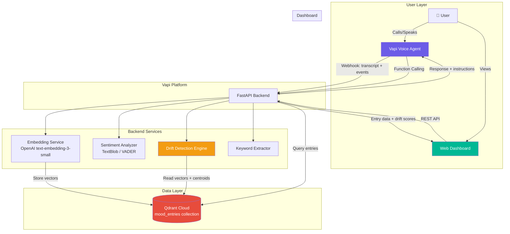
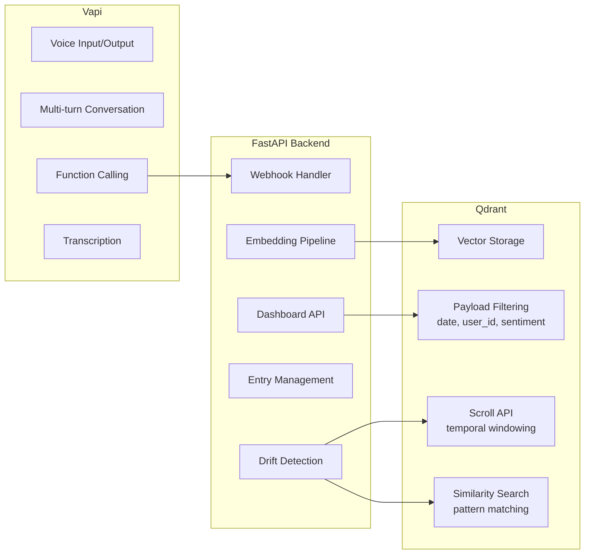
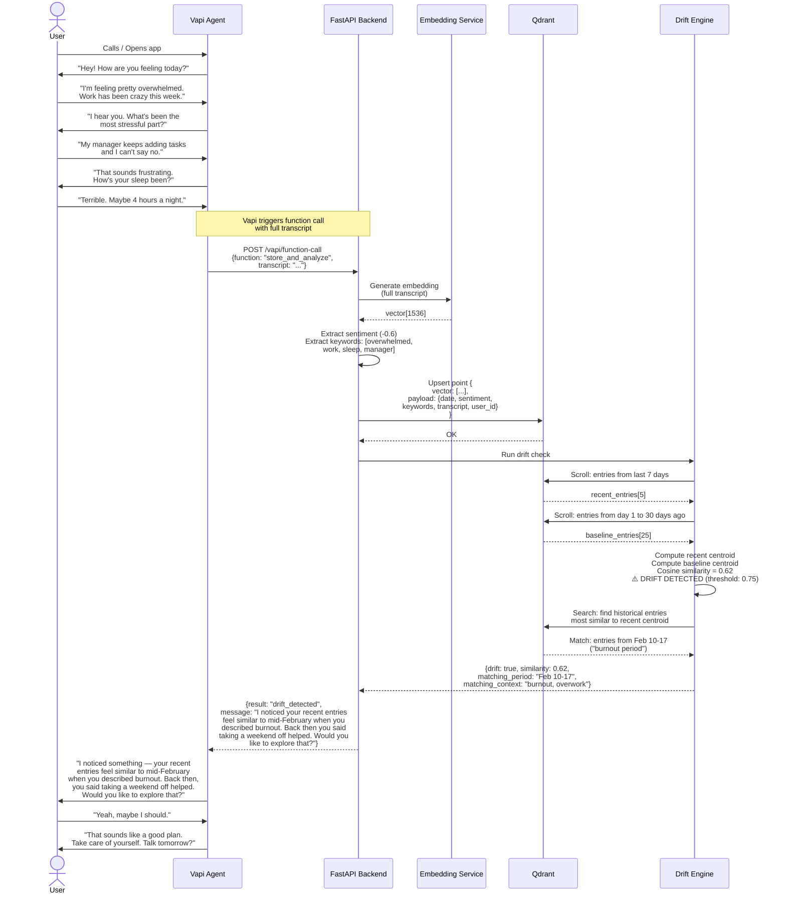
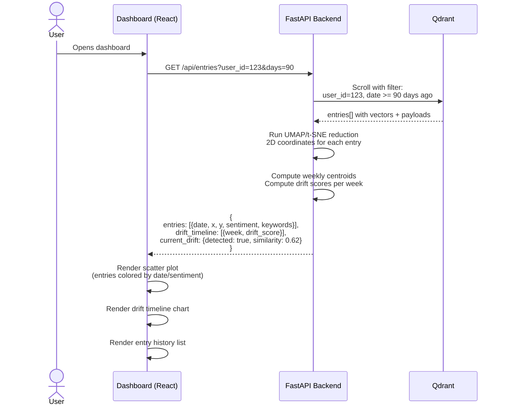
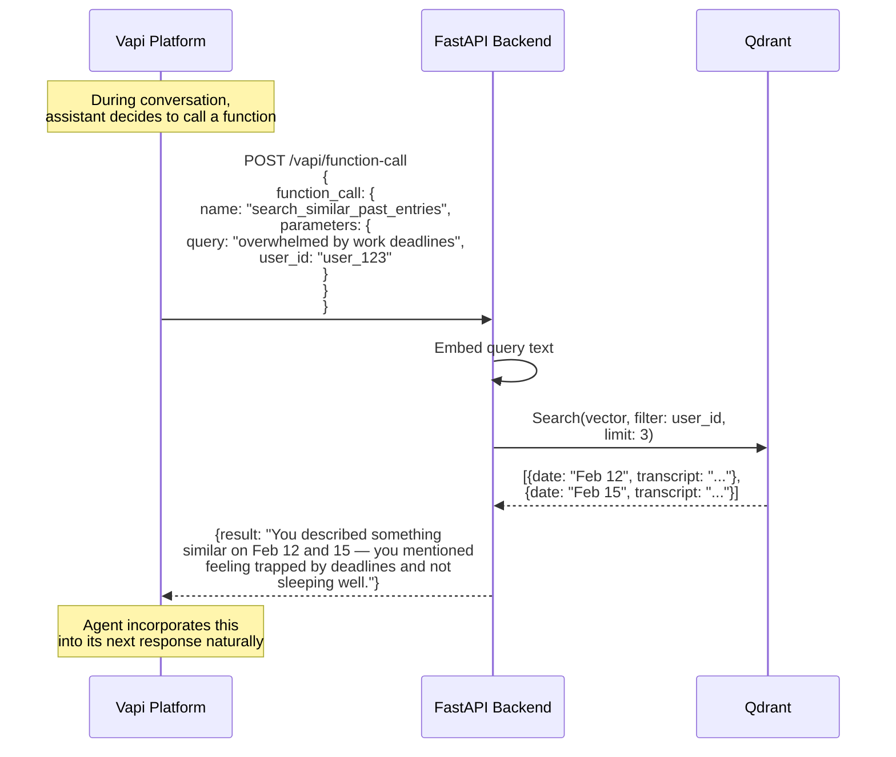

# MoodDrift — Voice Mood Tracker with Semantic Drift Detection

> *"Your journal that listens, remembers, and notices what you don't."*

**Track:** PS3 — Voice AI Agent for Accessibility & Societal Impact  
**Mandatory Stack:** Qdrant + Vapi  
**Team:** [Your Team Name]  
**Hackathon Deadline:** 16th April, 9:00 PM

---

## Table of Contents

1. [Problem](#1-problem)
2. [Solution](#2-solution)
3. [Key Features](#3-key-features)
4. [Architecture](#4-architecture)
5. [Sequence Diagrams](#5-sequence-diagrams)
6. [Tech Stack](#6-tech-stack)
7. [Qdrant Schema](#7-qdrant-schema)
8. [Vapi Configuration](#8-vapi-configuration)
9. [Drift Detection Algorithm](#9-drift-detection-algorithm)
10. [Project Structure](#10-project-structure)
11. [Phase-wise Build Plan](#11-phase-wise-build-plan)
12. [API Endpoints](#12-api-endpoints)
13. [Demo Script](#13-demo-script)
14. [Disclaimers](#14-disclaimers)
15. [Judge Review & Critical Fixes](#15-judge-review--critical-fixes)

---

## 1. Problem

### The Core Issue
- **450 million+ people** worldwide suffer from mental health conditions (WHO).
- Journaling is clinically proven to improve self-awareness and emotional regulation.
- But **typing-based journaling has an 85%+ dropout rate** within 2 weeks — too much friction.
- People who would benefit most — those with low literacy, motor disabilities, or cognitive overload — are excluded entirely from text-based tools.
- Even those who DO journal can't see **patterns in their own emotional trajectory**. You don't notice you're drifting into burnout until you're already burned out.

### What's Missing
1. **A zero-friction journaling interface** — voice eliminates the typing barrier.
2. **Pattern recognition over time** — humans are bad at noticing gradual emotional shifts.
3. **Contextual self-awareness** — connecting today's feelings to historical patterns.
4. **Accessibility** — works for people who can't type, can't read well, or are visually impaired.

---

## 2. Solution

**MoodDrift** is a voice-first emotional self-awareness tool.

### How It Works (User Perspective)
1. **Daily 2-minute voice check-in**: User calls or opens the app → Vapi agent asks "How are you feeling today? What happened?"
2. **Conversational follow-up**: Agent asks contextual follow-ups based on what you said.
3. **Silent processing**: System embeds your entry, stores it in Qdrant with temporal metadata.
4. **Drift detection**: System constantly compares your recent emotional vectors against your baseline.
5. **Proactive insight**: When drift is detected, the agent tells you: *"Your entries this week feel similar to how you described your burnout period in February. Last time, you said taking a weekend off helped. Would you like to try that?"*
6. **Dashboard**: Visual timeline of your emotional journey — embedding clusters, mood trends, keyword patterns.

### Why This is Different from "Voice + RAG"
- This is **NOT retrieval-augmented generation**. There is no document corpus to search.
- This is **temporal vector analysis** — using Qdrant as a time-series vector database.
- The insight comes from **comparing vector distributions over time**, not from searching for answers.

---

## 3. Key Features

### Core (Must-Have for MVP)
| # | Feature | Qdrant Role | Vapi Role |
|---|---------|-------------|-----------|
| F1 | Multi-turn voice check-in | — | Conversational assistant with structured follow-ups |
| F2 | Mood embedding & storage | Store entry vectors with date/sentiment metadata | Transcription via webhook |
| F3 | Semantic drift detection | Centroid comparison: recent window vs. baseline | — |
| F4 | Historical pattern matching | Similarity search against all past entries | Delivers insight conversationally |
| F5 | Guided reflection | Retrieves coping strategies from similar past entries | Multi-turn follow-up conversation |
| F6 | Dashboard visualization | Scroll API for paginated entry retrieval | — |

### Enhanced (Nice-to-Have)
| # | Feature | Description |
|---|---------|-------------|
| F7 | Weekly voice summary | Vapi calls YOU with a weekly emotional summary |
| F8 | Keyword trend tracking | Extract + track recurring themes (work, family, sleep) |
| F9 | Mood scoring timeline | Sentiment score plotted over time |
| F10 | Multi-user support | Payload filtering by user_id |
| F11 | Export journal | Download full transcript history as PDF |

---

## 4. Architecture

### High-Level Architecture



### Component Responsibilities



---

## 5. Sequence Diagrams

### 5.1 Daily Check-in Flow



### 5.2 Dashboard Data Flow



### 5.3 Vapi Function Calling Flow



---

## 6. Tech Stack

| Layer | Technology | Why |
|-------|-----------|-----|
| **Voice Agent** | Vapi | Mandatory. Multi-turn, function calling, phone/web support |
| **Vector DB** | Qdrant Cloud (free tier) | Mandatory. Payload filtering + scroll API = temporal vector analysis |
| **Backend** | Python + FastAPI | Fast to build, great Qdrant/OpenAI SDK support |
| **Embeddings** | OpenAI `text-embedding-3-small` (1536-dim) | Best quality/cost ratio. ~$0.02 per 1M tokens |
| **Sentiment** | VADER (nltk) | Free, no API calls, good enough for English |
| **Keyword Extraction** | KeyBERT or simple TF-IDF | Lightweight, local |
| **Dashboard** | React + Recharts + react-plotly.js | Interactive scatter plot + line charts |
| **Dimensionality Reduction** | UMAP (umap-learn) | Better than t-SNE for preserving global structure |
| **Deployment** | Backend: Railway/Render (free tier) | Fast deploy, free |
| **Alternative Embedding** | `all-MiniLM-L6-v2` via sentence-transformers | Free, local, 384-dim. Use if OpenAI budget is a concern |

---

## 7. Qdrant Schema

### Collection: `mood_entries`

```
Collection Config:
  - vectors:
      size: 1536  (or 384 if using MiniLM)
      distance: Cosine
  - on_disk_payload: true
```

### Point Structure

```json
{
  "id": "uuid-v4",
  "vector": [0.012, -0.034, ...],  // 1536-dim embedding of full transcript
  "payload": {
    "user_id": "user_123",
    "date": "2026-04-14",
    "timestamp": 1744656000,
    "transcript": "I'm feeling overwhelmed. Work has been crazy...",
    "sentiment_score": -0.6,       // -1.0 (very negative) to 1.0 (very positive)
    "keywords": ["overwhelmed", "work", "sleep", "manager"],
    "week_number": 16,
    "month": "2026-04",
    "entry_type": "checkin"        // "checkin" | "reflection" | "followup"
  }
}
```

### Key Qdrant Operations Used

| Operation | Purpose | Why Not a Regular DB |
|-----------|---------|---------------------|
| `upsert` | Store new mood entry with vector + metadata | Need vector storage |
| `scroll` with date filter | Get entries in a time window (last 7d, last 90d) | Need vectors back, not just metadata |
| `search` | Find historically similar entries | Semantic similarity, not keyword match |
| Centroid computation (client-side) | Compare recent vs. baseline emotional state | Novel use — vector distribution analysis |
| `search` with payload filter | "Show me entries from February where I felt like this" | Combines semantic + temporal filtering |

---

## 8. Vapi Configuration

### Assistant Config

```json
{
  "name": "MoodDrift Companion",
  "model": {
    "provider": "openai",
    "model": "gpt-4o-mini",
    "temperature": 0.7,
    "systemPrompt": "You are a warm, empathetic emotional check-in companion called MoodDrift. Your job is to have a brief 2-minute daily conversation about how the user is feeling. You are NOT a therapist. You are a self-awareness journaling tool.\n\nConversation structure:\n1. Ask how they're feeling today (open-ended)\n2. Ask ONE follow-up about what's driving that feeling\n3. Ask about one physical indicator (sleep, energy, appetite)\n4. Call the store_and_analyze function with the full context\n5. If drift is detected, share the insight warmly\n6. Close with encouragement\n\nRules:\n- Never diagnose or prescribe\n- Never say 'I'm just an AI'\n- Keep responses under 3 sentences\n- Be warm but not saccharine\n- If user mentions self-harm or crisis, provide crisis helpline number immediately"
  },
  "voice": {
    "provider": "11labs",
    "voiceId": "calm-empathetic-voice"
  },
  "functions": [
    {
      "name": "store_and_analyze",
      "description": "Store the user's mood entry and check for emotional drift patterns",
      "parameters": {
        "type": "object",
        "properties": {
          "mood_summary": {
            "type": "string",
            "description": "A 2-3 sentence summary of the user's current emotional state"
          },
          "full_transcript": {
            "type": "string",
            "description": "The full conversation transcript"
          },
          "user_id": {
            "type": "string",
            "description": "The user's identifier"
          }
        },
        "required": ["mood_summary", "full_transcript", "user_id"]
      }
    },
    {
      "name": "search_similar_past_entries",
      "description": "Search for past entries that are emotionally similar to the current conversation",
      "parameters": {
        "type": "object",
        "properties": {
          "query": {
            "type": "string",
            "description": "The emotional theme to search for"
          },
          "user_id": {
            "type": "string",
            "description": "The user's identifier"
          }
        },
        "required": ["query", "user_id"]
      }
    }
  ],
  "serverUrl": "https://your-backend.railway.app/vapi/webhook"
}
```

### Vapi Function Calling — Why It Matters

The Vapi agent doesn't just record and hang up. Mid-conversation, it:
1. Calls `search_similar_past_entries` to check if the user has felt this way before
2. Calls `store_and_analyze` to embed, store, and run drift detection
3. Receives drift results and **naturally weaves them into the conversation**

This makes Vapi usage **deep**, not shallow. The agent is doing real-time retrieval and acting on it.

---

## 9. Drift Detection Algorithm

### Core Algorithm

```
DRIFT DETECTION (user_id, new_entry_vector):

1. RECENT WINDOW:
   - Query Qdrant: scroll(filter: user_id AND date >= 7_days_ago)
   - Collect vectors: V_recent = [v1, v2, ..., vn]
   - Compute centroid: C_recent = mean(V_recent)

2. BASELINE WINDOW:
   - Query Qdrant: scroll(filter: user_id AND date >= 30_days_ago AND date < 7_days_ago)
   - Collect vectors: V_baseline = [v1, v2, ..., vm]
   - Compute centroid: C_baseline = mean(V_baseline)

3. DRIFT SCORE:
   - drift_score = 1 - cosine_similarity(C_recent, C_baseline)
   - Range: 0 (no drift) to 2 (maximum drift)
   
4. DRIFT THRESHOLD:
   - If drift_score > 0.25 → DRIFT DETECTED
   - (Cosine similarity < 0.75)

5. PATTERN MATCHING (if drift detected):
   - Query Qdrant: search(vector: C_recent, filter: user_id AND date < 30_days_ago, limit: 5)
   - Find which historical PERIOD these matches cluster in
   - Return: "Your recent entries are similar to [date range] when you described [context]"

6. SEVERITY LEVELS:
   - 0.25 - 0.40: MILD drift ("slight shift noticed")
   - 0.40 - 0.60: MODERATE drift ("noticeable change in patterns")  
   - 0.60+: SIGNIFICANT drift ("your entries feel very different from your baseline")
```

### Edge Cases Handled

| Edge Case | Handling |
|-----------|----------|
| < 3 entries in recent window | Skip drift detection, not enough data |
| < 10 entries in baseline | Skip drift detection, still calibrating |
| Positive drift (getting better) | Detect and celebrate: "You seem to be feeling better than your baseline!" |
| Oscillating patterns | Compare week-over-week centroids, not just recent vs. baseline |
| First-time user | Calibration period: "I need about 2 weeks of entries to start noticing patterns" |

---

## 10. Project Structure

```
mooddrift/
├── PROJECT.md                    # This file — source of truth
│
├── backend/
│   ├── main.py                   # FastAPI app entry point
│   ├── config.py                 # Environment variables, constants
│   ├── requirements.txt          # Python dependencies
│   │
│   ├── routers/
│   │   ├── vapi_webhook.py       # Vapi webhook + function call handlers
│   │   ├── entries.py            # CRUD for mood entries
│   │   └── dashboard.py          # Dashboard data API
│   │
│   ├── services/
│   │   ├── embedding.py          # OpenAI embedding generation
│   │   ├── qdrant_service.py     # Qdrant client wrapper
│   │   ├── drift_engine.py       # Drift detection algorithm
│   │   ├── sentiment.py          # VADER sentiment analysis
│   │   └── keywords.py           # Keyword extraction
│   │
│   ├── models/
│   │   └── schemas.py            # Pydantic models
│   │
│   └── seed/
│       ├── seed_data.py          # Script to generate + seed 60 demo entries
│       └── sample_entries.json   # Pre-generated sample entries
│
├── dashboard/
│   ├── package.json
│   ├── src/
│   │   ├── App.tsx               # Main app
│   │   ├── components/
│   │   │   ├── ScatterPlot.tsx   # UMAP embedding visualization
│   │   │   ├── DriftTimeline.tsx # Drift score over time (line chart)
│   │   │   └── EntryList.tsx     # Scrollable entry history
│   │   ├── hooks/
│   │   │   └── useEntries.ts     # API data fetching
│   │   └── utils/
│   │       └── api.ts            # Backend API client
│   └── public/
│       └── index.html
│
├── vapi/
│   └── assistant_config.json     # Vapi assistant configuration
│
├── .env.example                  # Environment variable template
├── docker-compose.yml            # Optional: local Qdrant instance
└── README.md                     # Setup & run instructions
```

---

## 11. Phase-wise Build Plan

### Phase 1: Foundation (3-4 hours)
**Goal:** Backend skeleton + Qdrant connected + embedding pipeline working

| Task | Details | Done? |
|------|---------|-------|
| 1.1 | Set up FastAPI project with requirements.txt | ☐ |
| 1.2 | Create Qdrant Cloud cluster (free tier) — get URL + API key | ☐ |
| 1.3 | Create `mood_entries` collection with correct schema | ☐ |
| 1.4 | Build embedding service (OpenAI `text-embedding-3-small`) | ☐ |
| 1.5 | Build `qdrant_service.py` — upsert, scroll, search | ☐ |
| 1.6 | Build sentiment analysis (VADER) | ☐ |
| 1.7 | Build keyword extraction | ☐ |
| 1.8 | Test: manually insert an entry, verify it's in Qdrant | ☐ |

**Deliverable:** Can programmatically embed text → store in Qdrant → retrieve it.

---

### Phase 2: Vapi Integration (3-4 hours)
**Goal:** Voice check-in works end-to-end

| Task | Details | Done? |
|------|---------|-------|
| 2.1 | Create Vapi account, get API key, apply promo code `vapixhackblr` | ☐ |
| 2.2 | Create assistant with system prompt (from Section 8) | ☐ |
| 2.3 | Define functions: `store_and_analyze`, `search_similar_past_entries` | ☐ |
| 2.4 | Build `/vapi/webhook` endpoint to handle Vapi events | ☐ |
| 2.5 | Build function call handler — route to correct service | ☐ |
| 2.6 | Deploy backend to Railway/Render (need public URL for Vapi) | ☐ |
| 2.7 | Test: call the Vapi number → full check-in → entry appears in Qdrant | ☐ |

**Deliverable:** Can have a voice conversation → entry stored in Qdrant with metadata.

---

### Phase 3: Drift Detection (2-3 hours)
**Goal:** Drift detection works and feeds back into Vapi conversation

| Task | Details | Done? |
|------|---------|-------|
| 3.1 | Build `drift_engine.py` — centroid computation + comparison | ☐ |
| 3.2 | Build historical pattern matching (search similar past periods) | ☐ |
| 3.3 | Integrate drift result into `store_and_analyze` function response | ☐ |
| 3.4 | Create seed data script — 60 entries over 2 months with realistic drift | ☐ |
| 3.5 | Run seed script → verify drift detection catches the seeded pattern | ☐ |
| 3.6 | Test: do a check-in that should trigger drift → verify agent mentions it | ☐ |

**Deliverable:** After check-in, agent says "I noticed your entries this week feel similar to..."

---

### Phase 4: Dashboard (3-4 hours)
**Goal:** Visual proof of drift detection

| Task | Details | Done? |
|------|---------|-------|
| 4.1 | Set up React app (Vite + TypeScript) | ☐ |
| 4.2 | Build dashboard API endpoints (`/api/entries`, `/api/drift-timeline`) | ☐ |
| 4.3 | Add UMAP reduction endpoint (backend computes 2D coordinates) | ☐ |
| 4.4 | Build ScatterPlot component — entries as dots, colored by date/sentiment | ☐ |
| 4.5 | Build DriftTimeline component — drift score over weeks | ☐ |
| 4.6 | Build EntryList component — scrollable entry history with drift status indicator | ☐ |
| 4.7 | Style everything (dark theme, clean, minimal) | ☐ |

**Deliverable:** Dashboard shows embedding clusters + drift timeline + entry history.

---

### Phase 5: Polish & Demo Prep (2-3 hours)
**Goal:** Demo-ready, no rough edges

| Task | Details | Done? |
|------|---------|-------|
| 5.1 | Seed data with a compelling narrative (good Feb → burnout mid-Feb → recovery → new drift in April) | ☐ |
| 5.2 | Test full flow: seed → voice check-in → drift detected → dashboard shows it | ☐ |
| 5.3 | Add guided reflection responses (not just "drift detected" but actionable) | ☐ |
| 5.4 | Add disclaimer banner on dashboard | ☐ |
| 5.5 | Record backup demo video (in case live demo fails) | ☐ |
| 5.6 | Write README with setup instructions | ☐ |
| 5.7 | Prepare 3-minute pitch script | ☐ |

**Deliverable:** Ready to present.

---

### Time Budget

| Phase | Hours | Cumulative |
|-------|-------|------------|
| Phase 1: Foundation | 3-4h | 4h |
| Phase 2: Vapi Integration | 3-4h | 8h |
| Phase 3: Drift Detection | 2-3h | 11h |
| Phase 4: Dashboard | 3-4h | 15h |
| Phase 5: Polish & Demo | 2-3h | 18h |
| **Buffer** | **2-3h** | **~20h** |

Fits within a 2-day sprint (April 14-16).

---

## 12. API Endpoints

### Vapi Webhook Endpoints

| Method | Path | Purpose |
|--------|------|---------|
| POST | `/vapi/webhook` | Main Vapi webhook — handles all event types |
| POST | `/vapi/webhook` (type: `function-call`) | Handles `store_and_analyze` and `search_similar_past_entries` |

### Dashboard API Endpoints

| Method | Path | Purpose |
|--------|------|---------|
| GET | `/api/entries` | Get all entries for a user (with pagination) |
| GET | `/api/entries?days=90` | Get entries within a time window |
| GET | `/api/drift-timeline` | Weekly drift scores for chart |
| GET | `/api/drift-current` | Current drift status |
| GET | `/api/visualization` | UMAP-reduced 2D coordinates for scatter plot |
| GET | `/api/keywords` | Trending keywords over time |

### Internal/Admin

| Method | Path | Purpose |
|--------|------|---------|
| POST | `/api/seed` | Seed demo data (dev/demo only) |
| DELETE | `/api/entries` | Clear all entries (dev only) |

---

## 13. Demo Script

### Pre-Demo Setup
- 60 pre-seeded entries spanning Jan 15 – April 14
- Narrative arc: Stable Jan → Burnout mid-Feb → Recovery March → New drift starts April 10

### Live Demo (3 minutes)

**[0:00 - 0:30] Problem Setup**
> "Journaling helps mental health, but 85% of people quit within 2 weeks. And even those who stick with it can't see their own patterns. What if your journal could listen, remember, and tell you things about yourself you didn't notice?"

**[0:30 - 1:30] Live Voice Check-in**
> *Call the Vapi number on speaker*
> Agent: "Hey, how are you feeling today?"
> User: "Honestly, not great. I've been really stressed about deadlines and I can barely sleep."
> Agent: *asks follow-up, then processes*
> Agent: "I noticed something — your entries this week feel a lot like mid-February, when you described burnout from overwork. Back then, you said taking a weekend completely offline helped reset things. Would that work for you right now?"

**[1:30 - 2:30] Dashboard Show**
> *Switch to dashboard*
> "Here's what's happening under the hood. This scatter plot shows every journal entry as a point — see how February's burnout entries [points] cluster separately from the healthy baseline? And look — this week's entries are drifting toward that same region."
> *Point to drift timeline* "This line shows the drift score over time. See the spike? That's now."

**[2:30 - 3:00] Close**
> "MoodDrift doesn't diagnose. It mirrors. It's your journal that listens, remembers, and notices what you don't. Built with Vapi for zero-friction voice input and Qdrant for temporal vector analysis — not just search, but understanding how your emotional patterns evolve."

---

## 14. Disclaimers

**Must be visible on dashboard and mentioned in demo:**

- MoodDrift is an emotional self-awareness and journaling tool. It is **NOT** a medical device, diagnostic tool, or substitute for professional mental health care.
- If you or someone you know is in crisis, contact a mental health professional or crisis helpline immediately.
- Insights are based on pattern recognition in your own words. They may be inaccurate or incomplete.
- All data is stored securely and is only accessible to the user.

---

## Appendix A: Environment Variables

```env
# Qdrant
QDRANT_URL=https://xxx.cloud.qdrant.io:6333
QDRANT_API_KEY=your-qdrant-api-key

# OpenAI (for embeddings)
OPENAI_API_KEY=sk-...

# Vapi
VAPI_API_KEY=your-vapi-api-key
VAPI_ASSISTANT_ID=your-assistant-id

# App
DEFAULT_USER_ID=demo_user
DRIFT_THRESHOLD=0.25
RECENT_WINDOW_DAYS=7
BASELINE_WINDOW_DAYS=30
```

## Appendix B: Seed Data Narrative

The 60 pre-seeded entries follow this arc:

| Period | Entries | Emotional State | Purpose |
|--------|---------|----------------|---------|
| Jan 15-31 | 12 | Stable, positive baseline — "good day at work", "gym felt great" | Establish healthy baseline |
| Feb 1-9 | 6 | Slight stress — "busy but manageable" | Transition period |
| Feb 10-20 | 8 | Burnout — "overwhelmed", "can't sleep", "dread going to work" | First drift event |
| Feb 21-28 | 5 | Recovery — "took time off", "feeling better" | Show recovery pattern |
| Mar 1-31 | 15 | Stable again — "back to normal", "productive" | New stable baseline |
| Apr 1-9 | 7 | Stable | Pre-drift stability |
| Apr 10-14 | 7 | New drift — "deadline pressure", "skipping meals", "anxious" | CURRENT drift (demo trigger) |

This creates a compelling narrative: the system successfully detects that April 10-14 resembles Feb 10-20 and surfaces that insight.

---

## 15. Judge Review & Critical Fixes

### Pre-Review Score: 7.5/10
### Target Score: 9/10 (with the fixes below)

---

### Fix 1: Live Entry During Demo (NOT Just Seeded Data)

**Problem:** If the entire demo runs on pre-seeded data, judges will think "this is just a slideshow with extra steps."

**Fix:** The demo MUST include a real-time voice check-in that:
1. Actually calls Vapi live on speaker
2. Stores a real entry in Qdrant during the demo
3. Triggers drift detection against the seeded baseline in real-time
4. Shows the new entry appear on the dashboard live

**Implementation:**
- Seed 59 entries pre-demo. The 60th is the LIVE one.
- Script the live check-in content to something that will trigger drift (e.g., mention "overwhelmed", "deadlines", "can't sleep" — similar to the Feb burnout cluster).
- Have the dashboard on auto-refresh (5-second polling) so the new entry appears visually.

**This is non-negotiable. No live entry = no win.**

---

### Fix 2: Show Mid-Conversation Qdrant Lookup Explicitly

**Problem:** If the Vapi agent just records and responds generically, judges will say "the LLM does the work, not Qdrant."

**Fix:** During the live check-in, the agent must:
1. DURING the conversation (not after), call `search_similar_past_entries`
2. Retrieve a specific past entry from Qdrant
3. Reference it by date and content: *"You mentioned something very similar on February 12th — you said you were dreading work because of deadline pressure. Is this the same kind of thing?"*

**Implementation:**
- The Vapi assistant's system prompt instructs it to call `search_similar_past_entries` after the user describes their mood (step 2 of conversation, not step 4).
- The function handler searches Qdrant, returns the most similar past entry with its date.
- The agent weaves this into the conversation naturally.

**Why this matters:** It proves Qdrant is active IN the conversation loop, not just a passive store. Vapi judges will see function calling in action. Qdrant judges will see real-time semantic search being used.

---

### Fix 3: Add Hindi Language Support (Regional Language)

**Problem:** PS3 is about accessibility. A monolingual English tool undermines the "accessibility for underserved populations" narrative. Judges will notice.

**Fix:** Support at least Hindi greeting + mixed-language conversation:
- Vapi agent greets in Hindi: *"Namaste! Aap aaj kaisa mehsoos kar rahe hain?"*
- If user responds in Hindi, agent continues in Hindi
- If user responds in English, agent switches to English
- Transcription works for both (Vapi supports multilingual)
- Embeddings work cross-lingually with multilingual models

**Implementation:**
- Use Vapi's multilingual voice (Deepgram supports Hindi transcription)
- Update system prompt: "Begin in Hindi. If the user responds in English, switch to English. Support mixed Hindi-English (Hinglish) naturally."
- Embedding model: OpenAI `text-embedding-3-small` handles Hindi reasonably well. No change needed.
- Demo in Hinglish for maximum impact — shows real-world accessibility.

**Scope:** This is a system prompt + Vapi config change. ~30 minutes of work. High ROI for judges.

---

### Fix 4: Clear Differentiator from Existing Mood Tracking Apps

**Problem:** Judges WILL ask: "How is this different from Daylio, Reflectly, or Moodfit?"

**Prepared Answer (memorize this):**

> "Existing mood trackers use sliders, buttons, and emoji pickers — they reduce your emotions to a number. MoodDrift uses your actual words. You speak freely, and the system embeds the full semantic meaning of what you said.
>
> Daylio can tell you 'you rated Tuesday a 3/5.' MoodDrift can tell you 'your entries this week sound like mid-February when you were burning out from deadline pressure — and back then, you said taking a weekend off helped.'
>
> The difference is: they track. We understand."

| Feature | Daylio / Reflectly | MoodDrift |
|---------|-------------------|-----------|
| Input method | Tap emoji / slider | Voice (zero friction) |
| What's stored | Discrete score (1-5) | Full semantic embedding |
| Pattern detection | "You scored low 3 days in a row" | "This week feels like your burnout in February" |
| Context recall | None | Retrieves specific past entries + what helped |
| Accessibility | Requires literacy + fine motor control | Works for anyone who can speak |

---

### Fix 5: Cut Dashboard Scope — 3 Charts, Not 5

**Problem:** Building 5 dashboard components (ScatterPlot, DriftTimeline, EntryList, MoodGauge, KeywordCloud) alongside backend + Vapi in 2 days is risky. If the dashboard is half-broken during demo, it hurts more than helps.

**Fix:** Ship exactly 3 components:

| Component | Priority | Justification |
|-----------|----------|---------------|
| **ScatterPlot** (UMAP) | MUST HAVE | This IS the demo moment. Visual proof of clustering. |
| **DriftTimeline** (line chart) | MUST HAVE | Shows drift score over time. Simple Recharts line. |
| **EntryList** (scrollable list) | MUST HAVE | Grounds the abstract charts in real journal entries. Include a drift status badge (green/yellow/red) at the top of this component instead of a separate MoodGauge. |
| ~~MoodGauge~~ | CUT | Fold into EntryList as a badge |
| ~~KeywordCloud~~ | CUT | Nice-to-have, not demo-critical |

**Time saved:** ~2-3 hours. Redirected to polishing the 3 remaining components and the live demo flow.

---

### Summary: Non-Negotiable Checklist Before Submission

- [ ] **Live voice entry during demo** — not just seeded data
- [ ] **Mid-conversation Qdrant lookup** — agent references a specific past entry by date
- [ ] **Hindi greeting support** — at least the opening + fallback to English
- [ ] **Differentiator answer rehearsed** — "They track. We understand."
- [ ] **Dashboard: 3 components only** — ScatterPlot, DriftTimeline, EntryList
- [ ] **Disclaimers visible** — "Not a diagnostic tool" on dashboard + in pitch
- [ ] **Backup demo video recorded** — in case live Vapi call fails
- [ ] **Crisis handling in system prompt** — agent provides helpline if self-harm mentioned
